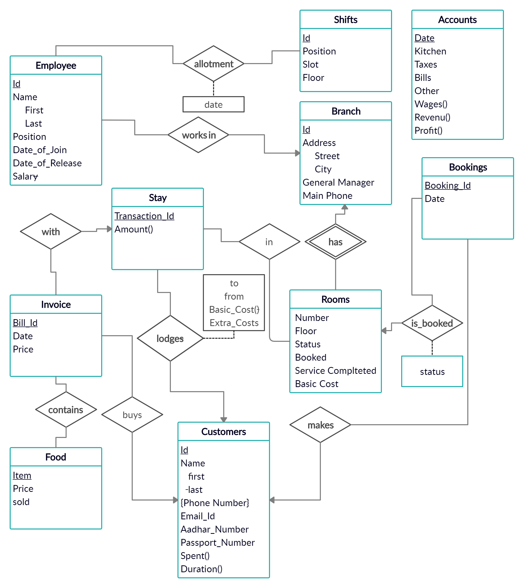

# Hotel-Chain-Management

**Database for Chain of Hotels**

## The Entity - Relation Diagram

## The Relational Schema

**Branch**(<u>id</u>, street, city, general_manager, main_phone)  
**Employee**(<u>id</u>, first_name, last_name, position, date_of_join, date of release, salary, branch)  
**Shifts**(<u>id</u>, position, slot, floor)  
**Rooms**(<u>branch_id</u>, <u>number</u>, floor, status, booked, serviced, basic_cost)  
**Stay**(<u>transaction_id</u>, customer_id,to,from,extra_cost)    
**Invoice**(<u>bill_id</u>, date, price, transaction_id, customer_id)  
**Food**(<u>item</u>, price, sold)  
**Customer**(<u>id</u>, first, last, email, aadhar_number, passport_number)  
**Booking**(<u>booking_id</u>, date, room_number, branch_id, status, customer_id)  
**Accounts**(<u>date</u>, kitchen, taxes, bills, other)  
**Contains**(<u>bill_id</u>, <u>food_item</u>)  
**In**(<u>transaction_id</u>, <u>room_number</u>, <u>branch</u>)  
**Allotment**(<u>emp_id</u>, <u>shift_id</u>, <u>date</u>)  

